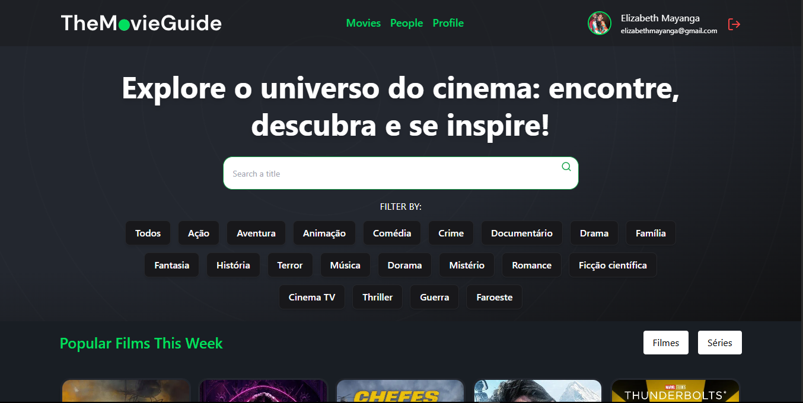

  
  
  

  

# The-Movie-Guide 🎬

> Uma aplicação React moderna para busca e visualização de filmes, consumindo dados da TMDB API, com design responsivo, experiência de usuário aprimorada e código escalável.

---

## Sobre o Projeto

O _MovieFinder_ é uma aplicação web desenvolvida em React + Vite, que permite ao usuário buscar filmes, visualizar detalhes completos, e navegar por uma interface responsiva e moderna. O projeto consome dados da [TMDB API](https://www.themoviedb.org/documentation/api) e foi desenvolvido com foco em boas práticas de UI/UX, componentização e escalabilidade.

---

## Funcionalidades

- _Busca de Filmes:_ Campo de busca por título, com resultados em tempo real.
- _Listagem de Resultados:_ Exibe pôster, nome, ano e nota dos filmes.
- _Listagem atores:_ Exibe imagem, nome, biografia e algumas informções pessoais dele e também exibi alguns filmes em que ele participou.
- _Página de Detalhes:_ Ao clicar em um filme, mostra sinopse, gêneros, data de lançamento, nota e pôster ampliado.
- _Responsividade:_ Layout adaptável para mobile, tablet e desktop.
- _Feedback Visual:_ Loader animado durante requisições e mensagens de erro amigáveis (ex: filme não encontrado).
- _Navegação Protegida:_ Rotas privadas para páginas que exigem autenticação.
- _Autenticação:_ Telas de login, registro e perfil de usuário.
- _Componentização:_ Componentes reutilizáveis para Navbar, Loader, Filtros, etc.

---

## Tecnologias Utilizadas

---

## Links Úteis

- [TMDB API](https://www.themoviedb.org/documentation/api)
- [Auth-api docs](http://localhost:5000/api-docs/#/)
- [Auth-api](https://auth-api-jwt.onrender.com)

---

## Como Rodar o Projeto

1. _Clone o repositório:_
   sh
   git clone <url-do-repo>
   cd movies-guide
2. _Instale as dependências:_
   sh
   npm install
3. _Configure a API Key da TMDB:_
   - Crie um arquivo .env na raiz do projeto e adicione sua chave:
     env
     VITE_TMDB_API_KEY=your_tmdb_api_key
4. _Inicie o projeto:_
   sh
   npm run dev
5. _Acesse no navegador:_
   - [http://localhost:5173](http://localhost:5173)

---

## Estrutura de Pastas

src/
assets/ # Imagens e ícones
components/ # Componentes reutilizáveis (Navbar, Loader, Filter, etc)
contexts/ # Contextos globais (ex: AuthContext)
hooks/ # Custom hooks (ex: useFetchUser)
pages/ # Páginas principais (Home, Detalhes, Login, etc)
routes/ # Definição de rotas e rotas privadas
services/ # Serviços de API (ex: api.ts)
types/ # Tipagens TypeScript
index.css # Estilos globais
main.tsx # Ponto de entrada da aplicação

---

## Diferenciais

- Deploy pronto para Vercel/Netlify
- Paginação e scroll infinito
- Filtros por categoria (ação, comédia, etc)
- Armazenamento em cache/localStorage
- Componentização escalável
- Testes com React Testing Library (estrutura preparada)
- Animações com Framer Motion (estrutura preparada)

---

## Autor

Desenvolvido por _joão tambue_

---

## Show your support

Give a ⭐ if this project helped you!

---

_This README was generated with ❤ by [readme-md-generator](https://github.com/kefranabg/readme-md-generator)_
